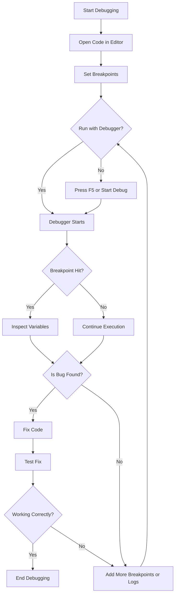

### 1. Comparison of Google colab, Jupyter Notebook and VS Code IDEs

| Feature | Google Colab | Jupyter Notebook | VS Code |
| --- | --- | --- | --- |
| Type | Cloud-based notebook | Local notebook | Full IDE / code editor |
| Installation | Not required | Yes (Anaconda/Python) | Yes (VS Code + Python extension) |
| Runs on | Google servers | Your computer | Your computer |
| File type | .ipynb | .ipynb | .py, .ipynb, all file types |
| Supports notebooks | Yes | Yes | Yes (via extension) |
| Supports normal .py files | No | Not directly | Yes (primary mode) |
| Internet required | Yes | No | No (after install) |
| GPU/TPU support | Free (limited) | No (unless custom setup) | No (unless installed separately) |
| Libraries | Preinstalled ML/data libs | Install manually | Install manually |
| Best for | Data science, learning | Learning, experiments | Real development, scripting, projects |
| Performance depends on | Google’s servers | Your PC speed | Your PC speed |
| Collaboration | Excellent (like Google Docs) | Weak | Good (GitHub integration) |
| Auto-saving | Yes (Google Drive) | Not by default | Yes |
| Multi-file projects | Hard | Hard | Easy |
| Command-line / terminal | No | Basic | Built-in terminal |
| Extensions / plugins | Few | Few | Thousands |
| Debugging tools | Basic (print) | Basic | Advanced debugger |

### 2.

### Next below this

