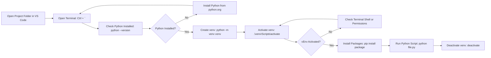

### 

```mermaid

flowchart LR

A[Open Project Folder in VS Code] --> B[Open Terminal: Ctrl + `]
B --> C[Check Python Installed: python --version]
C --> D{Python Installed?}

D -->|No| E[Install Python from python.org]
E --> B

D -->|Yes| F[Create venv: python -m venv venv]
F --> G[Activate venv: .\venv\Scripts\activate]
G --> H{vEnv Activated?}

H -->|No| I[Check Terminal Shell or Permissions]
I --> G

H -->|Yes| J[Install Packages: pip install package]
J --> K[Run Python Script: python file.py]
K --> L[Deactivate venv: deactivate]


```

